# Go/Echo+<span style="color:yellow"></></span>Templ: User List App as an example of a [project structured in layers](https://templ.guide/project-structure/project-structure), use of *Templ* Template language and frontend with HTMx technology (demo)

A full stack application using Golang's Echo framework. Requests to the backend are improved in their "aesthetic" aspect with the use [</>htmx](https://htmx.org/) ([hypermedia](https://hypermedia.systems/) only).

### Explanation

The architecture follows a typical "onion model" where each layer doesn't know about the layer above it, and each layer is responsible for a specific thing. Although the application is extremely simple, we use this pattern to illustrate its use in more complex applications.

Layering an application in this way can simplify code structure, since the responsibility of each type is clear.

To ensure that each part of the application is initialized with its dependencies, each struct defines a constructor (the New function in this example).



<br>

>[!NOTE]
>***In this application, instead of using the html/template package (gofiber/template/html, specifically), we use the [a-h/templ](https://github.com/a-h/templ) library. This amazing library implements a templating language (very similar to JSX) that compiles to Go code. Templ will allow us to write code almost identical to Go (with expressions, control flow, if/else, for loops, etc.) and have autocompletion thanks to strong typing. This means that errors appear at compile time and any calls to these templates (which are compiled as Go functions) from the handlers side will always require the correct data, minimizing errors and thus increasing the security and speed of our coding.***

On the other hand, we use Golang's [Echo](https://echo.labstack.com/docs) web framework, which as stated on its website is a "High performance, extensible, minimalist Go web framework".

The use of </>htmx allows behavior similar to that of a SPA, without page reloads when switching from one route to another or when making requests (via AJAX) to the backend.

On the other hand, the styling of the views is achieved through Tailwind CSS and DaisyUI that are obtained from their respective CDNs.

---

## Setup:

Besides the obvious prerequisite of having Go! on your machine, you must have Air installed for hot reloading when editing code.

Start the app in development mode:

```
$ air # Ctrl + C to stop the application
```

Build for production:

```
$ go build -ldflags="-s -w" -o ./bin/main ./cmd/main.go # ./bin/main to run the application
```

>[!TIP]
>***In order to have autocompletion and syntax highlighting in VS Code for the Teml templating language, you will have to install the [templ-vscode](https://marketplace.visualstudio.com/items?itemName=a-h.templ) extension (for vim/nvim install this [plugin](https://github.com/joerdav/templ.vim)). To generate the Go code corresponding to these templates you will have to download this [executable binary](https://github.com/a-h/templ/releases/tag/v0.2.476) from Github and place it in the PATH of your system. The command:***

```
$ templ generate --watch
```

>[!TIP]
>***This will allow us to monitor changes to the .templ files and compile them as we save them. Review the documentation on Templ [installation](https://templ.guide/quick-start/installation) and [support](https://templ.guide/commands-and-tools/ide-support/) for your IDE.***

---

### Happy coding 😀!!